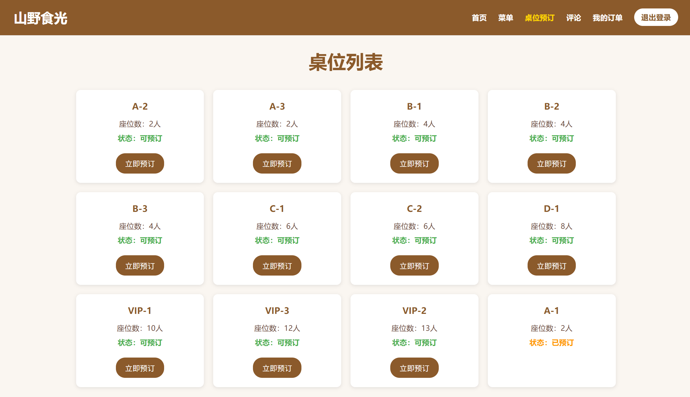

# 餐饮管理系统

## 1. 需求分析

本小组为一家餐厅设计餐饮管理系统. 我们设计了用户(餐厅顾客)和管理员(餐厅经理)两个身份, 结合实际情况和需求设计了以下功能.

首先, 用户和管理员的身份必须严格区分开. 用户不能注册与管理员用户名相同的账号. 用户与管理员的访问权限也有差别, 只有管理员才有权限进行菜品和桌位的删除和管理操作.

### 用户的需求

1. 用户必须能安全地注册新用户, 并进行登录验证.
2. 管理系统首页展示餐厅名称, 推荐菜品, 餐厅评价, 地址电话号码等信息.
3. 用户点餐并查看历史点餐信息, 包括所点的菜品, 价格以及订单状态.
4. 桌位预订. 用户可选择空闲的桌位, 并选择就餐时间, 人数及备注, 并在同一界面看到所有的预订与其状态.
5. 评论. 用户可以对餐厅从多个方面进行评分(打星), 并提交文字评论, 并且能看到其他用户的所有评论.

### 管理员的需求

1. 菜品管理. 餐厅经理能够进行菜品的添加, 删除, 修改.
2. 桌位管理. 餐厅经理能够进行桌位的添加, 删除, 修改每张桌位能容纳的人数及其状态.
3. 订单管理. 餐厅经理能够看到完整的订单信息, 并且修改订单的状态.
4. 餐厅经理需要看到所有的预订信息, 并根据预订信息进行桌位管理.
5. 餐厅经理能够看到用户的所有评论, 能够对评论进行回复.

根据上述需求, 我们绘制了相应的E-R图如下:


## 2. 技术实现

### 数据库设计

#### 1. 关系表设计

首先, 我们将E-R图转化为可部署的关系表. 转换时遵循以下规则:

1. 将每个实体类型转换为一个数据库表
2. 将每个属性转化为表的一列
3. 根据实际参考情况在相应的表中添加外键.

最后, 设计的关系表如下:

1. **users**：用户信息表

- user_id (主键)

- username (用户名)

- password (密码，使用werkzeug加密, 保证安全性)

- phone (电话)

- address (地址)

- is_admin (是否为管理员)

- created_at (创建时间)

```sql
CREATE TABLE users (
    user_id INT PRIMARY KEY AUTO_INCREMENT,
    username VARCHAR(50) UNIQUE,
    password VARCHAR(255),
    phone VARCHAR(20),
    address TEXT,
    is_admin BOOLEAN DEFAULT FALSE,
    created_at TIMESTAMP DEFAULT CURRENT_TIMESTAMP
);
```

2. **dishes**：菜品表

- dish_id (主键)

- name (菜品名称)

- category (分类)

- price (价格)

- description (描述)

- image_url (图片URL)

- sort_order (排序顺序)

```sql
CREATE TABLE dishes (
    dish_id INT PRIMARY KEY AUTO_INCREMENT,
    name VARCHAR(100),
    category VARCHAR(50),
    price DECIMAL(10,2),
    description TEXT,
    image_url VARCHAR(255),
    sort_order INT
);
```

3. **bulk_orders**：订单主表, 反映整个订单的情况(单个菜品的情况在`order_detail`中体现)

- bulk_order_id (主键)

- user_id (用户ID，外键)

- total_amount (总金额)

- address (配送地址)

- phone (联系电话)

- payment_method (支付方式)

- status (订单状态)

- order_time (下单时间)

- dining_type (就餐方式)

- table_id (桌位ID，外键)

```sql
CREATE TABLE bulk_orders (
    bulk_order_id INT PRIMARY KEY AUTO_INCREMENT,
    user_id INT,
    total_amount DECIMAL(10,2),
    address TEXT,
    phone VARCHAR(20),
    payment_method VARCHAR(20),
    status VARCHAR(20),
    order_time TIMESTAMP,
    dining_type VARCHAR(20),
    table_id INT,
    FOREIGN KEY (user_id) REFERENCES users(user_id),
    FOREIGN KEY (table_id) REFERENCES tables(table_id)
);
```

4. **order_details**：订单详情表, 反映订单中一个菜品的情况, 通过外码对应到相应的`bulk_orders`

- detail_id (主键)

- bulk_order_id (订单ID，外键)

- dish_id (菜品ID，外键)

- dish_name (菜品名称)

- quantity (数量)

- price (单价)

- amount (小计)

```sql
CREATE TABLE order_details (
    detail_id INT PRIMARY KEY AUTO_INCREMENT,
    bulk_order_id INT,
    dish_id INT,
    dish_name VARCHAR(100),
    quantity INT,
    price DECIMAL(10,2),
    amount DECIMAL(10,2),
    FOREIGN KEY (bulk_order_id) REFERENCES bulk_orders(bulk_order_id),
    FOREIGN KEY (dish_id) REFERENCES dishes(dish_id)
);
```

5. **tables**：桌位表

- table_id (主键)

- table_name (桌位名称)

- seats (座位数)

- tatus (状态)

```sql
CREATE TABLE tables (
    table_id INT PRIMARY KEY AUTO_INCREMENT,
    table_name VARCHAR(50),
    seats INT,
    status VARCHAR(20)
);
```

6. **table_reservations**：桌位预订表

- reservation_id (主键)

- table_id (桌位ID，外键)

- user_id (用户ID，外键)

- reservation_time (预订时间)

- duration (预订时长)

- status (预订状态)

- notes (备注)

- people_count (用餐人数)

```sql
CREATE TABLE table_reservations (
    reservation_id INT PRIMARY KEY AUTO_INCREMENT,
    table_id INT,
    user_id INT,
    reservation_time DATETIME,
    duration INT,
    status VARCHAR(20),
    notes TEXT,
    people_count INT,
    FOREIGN KEY (table_id) REFERENCES tables(table_id),
    FOREIGN KEY (user_id) REFERENCES users(user_id)
);
```

7. **reviews**：评价表

- review_id (主键)

- user_id (用户ID，外键)

- bulk_order_id (订单ID，外键)

- rating (总体评分)

- food_rating (食物评分)

- service_rating (服务评分)

- environment_rating (环境评分)

- content (评价内容)

- review_time (评价时间)

```sql
CREATE TABLE table_reservations (
    reservation_id INT PRIMARY KEY AUTO_INCREMENT,
    table_id INT,
    user_id INT,
    reservation_time DATETIME,
    duration INT,
    status VARCHAR(20),
    notes TEXT,
    people_count INT,
    FOREIGN KEY (table_id) REFERENCES tables(table_id),
    FOREIGN KEY (user_id) REFERENCES users(user_id)
);
```

经验证, 本关系表符合3NF规范, 因此是一个合理的数据库设计.

#### 2. 状态设计

我们根据实际需求为订单和桌位设置了多个不同的状态, 管理员可以在不同的状态之间切换, 从而更好地贴合实际情况.

1. 订单状态

   ```sql
   ORDER_STATUS = {
       'pending': '待支付',
       'preparing': '准备中',
       'completed': '已完成',
       'cancelled': '已取消'
   }
   ```

2. 桌位状态

   ```sql
   TABLE_STATUS = {
       'available': '可用',
       'reserved': '已预订',
       'occupied': '使用中'
   }
   ```

### 前端设计

1. 技术栈

   本项目前端主要用到的技术栈有: HTML5、CSS3、JavaScript、AJAX.

   - 页面结构和页面样式采用HTML5、CSS3, 以支持响应式布局.
   - 采用JavaScript以支持页面交互功能.
   - 采用Jinjia2模板进行后端渲染的动态内容.
   - 采用AJAX技术以实现无刷新实时更新, 提升用户的体验感.

2. 页面结构

   所用到的html界面展示如下. 分为用户端和管理员端两个界面. 

- **用户端页面**：
  - 首页(index.html) 展示餐厅介绍,  推荐菜品和评价.
  - 菜单页(menu.html) 展示菜品和购物车功能, 并支持用户下单操作.
  - 菜品详情(dish_detail.html): 展示单个菜品详细信息和下单.
  - 我的订单(my_orders.html): 展示用户订单列表
  - 订单详情(order_detail.html, bulk_order_detail.html); 展示订单详细信息. 其中order_detail.html仅展示一个订单中单个菜品的订单信息, 而bulk_order_detail.html展示订单的详细信息, 包括订单详细表格, 总金额等, 用于购物车界面的展示.
  - 桌位预订(tables.html, reservation.html): 展示桌位列表和用户的预订情况.
  - 用户注册/登录/评论等页面(register.html, login.html, my_reviews.html)
- **管理员端页面**：
  - 菜品管理(dishes.html, edit_dish.html): 供管理员增删改查菜品.
  - 订单管理(order.html, order_detail.html): 展示订单列表和订单详情;  可供管理员修改订单状态.
  - 桌位管理(tables.html): 实现桌位的增删改查.

### 后端设计

1. 技术栈

   后端主要用到的技术为Python Flask框架.

2. 路由模块划分:

   后端的主要路由模块划分如下:

   1. 用户相关路由:

      ```python
      @app.route('/login')        # 登录
      @app.route('/register')     # 注册
      @app.route('/logout')       # 登出
      ```

   2. 菜单相关路由:

      ```python
      @app.route('/menu')                    # 菜单浏览
      @app.route('/dish/<int:dish_id>')     # 菜品详情
      @app.route('/api/search_dishes')       # 菜品搜索API
      ```

   3. 订单相关路由:

      ```python
      @app.route('/place_bulk_order')                # 下单
      @app.route('/bulk_order/<int:bulk_order_id>') # 订单详情
      @app.route('/my_orders')                       # 我的订单
      ```

   4. 预订相关路由:

      ```python
      @app.route('/tables')                          # 桌位列表
      @app.route('/api/reserve_table')               # 预订API
      @app.route('/api/my_reservations')            # 我的预订
      @app.route('/api/cancel_reservation/<id>')    # 取消预订
      ```

   5. 评价相关路由

      ```python
      @app.route('/my_reviews')                     # 我的评价
      @app.route('/add_review/<int:bulk_order_id>') # 添加评价
      @app.route('/edit_review/<int:review_id>')    # 编辑评价
      ```

   6. 管理员路由

      ```python
      @app.route('/admin/dishes')      # 菜品管理
      @app.route('/admin/orders')      # 订单管理
      @app.route('/admin/tables')      # 桌位管理
      @app.route('/admin/reviews')     # 评论管理
      ```

3. 权限控制

   利用权限装饰器来控制路由的访问权限.

   1. 用户登录装饰器 (login_required)

      用于确保只有用户才能访问到某些路由

      ```python
      from functools import wraps
      from flask import session, redirect, url_for
      
      def login_required(f):
          @wraps(f)
          def decorated_function(*args, **kwargs):
              # 检查session中是否存在user_id
              if 'user_id' not in session:
                  # 未登录则重定向到登录页
                  return redirect(url_for('login'))
              # 已登录则继续执行原函数
              return f(*args, **kwargs)
          return decorated_function
      ```

   2. 管理员权限装饰器(admin_required)

      用于确保只有管理员才能访问到某些路由

      ```python
      def admin_required(f):
          @wraps(f)
          def decorated_function(*args, **kwargs):
              # 检查是否登录且是管理员
              if 'is_admin' not in session or not session['is_admin']:
                  # 非管理员则重定向
                  return redirect(url_for('login'))
              # 是管理员则继续执行原函数
              return f(*args, **kwargs)
          return decorated_function
      ```

4. 核心业务逻辑
   部分核心业务处理方式展示如下, 通过执行相应的数据库语句来进行相应的增删改操作

   1. 订单处理

      ```python
      @app.route('/place_bulk_order', methods=['POST'])
      @login_required
      def place_bulk_order():
          # 1. 获取订单数据
          data = request.json
          
          # 2. 创建订单主表记录
          cursor.execute(
              'INSERT INTO bulk_orders (...) VALUES (...)',
              (session['user_id'], total, address, ...)
          )
          
          # 3. 创建订单详情记录
          for item in items:
              cursor.execute(
                  'INSERT INTO order_details (...) VALUES (...)',
                  (bulk_order_id, item['id'], ...)
              )
      ```

   2. 预订处理

      ```python
      @app.route('/api/reserve_table', methods=['POST'])
      @login_required
      def api_reserve_table():
          # 1. 验证桌位可用性
          cursor.execute('SELECT * FROM tables WHERE table_id = %s', (table_id,))
          
          # 2. 创建预订记录
          cursor.execute(
              'INSERT INTO table_reservations (...) VALUES (...)',
              (table_id, session['user_id'], ...)
          )
          
          # 3. 更新桌位状态
          cursor.execute('UPDATE tables SET status = %s', ('reserved',))
      ```

5. API设计

   该系统的所有API采用统一的设计规范, 为JSON格式

   ```json
   {
       'success': True/False,    # 操作是否成功
       'message': 'string',      # 提示信息
       'data': {}               # 数据载荷(可选)
   }
   ```

   本项目的API设计保证了如下特点:

   1. **统一的返回格式**：所有 API 返回统一的 JSON 格式，便于前端处理
   2. **权限控制**：使用装饰器确保 API 访问安全
   3. **错误处理**：统一的异常处理和错误返回
   4. **数据库事务**：涉及多表操作时使用事务确保数据一致性
   5. **参数验证**：API 接收参数前进行必要的验证

   以预订桌位为例, 调用API的过程如下:

   ```python
   @app.route('/api/reserve_table', methods=['POST'])
   @login_required
   def api_reserve_table():
       data = request.json
       
       conn = get_db_connection()
       cursor = conn.cursor()
       
       try:
           # 检查桌位是否可用
           cursor.execute('''
               SELECT * FROM table_reservations 
               WHERE table_id = %s 
               AND reservation_time = %s 
               AND status != 'cancelled'
           ''', (data['table_id'], data['reservation_time']))
           
           if cursor.fetchone():
               return jsonify({
                   'success': False,
                   'message': '该时段已被预订'
               })
               
           # 创建预订记录
           cursor.execute('''
               INSERT INTO table_reservations 
               (table_id, user_id, reservation_time, duration, people_count, notes)
               VALUES (%s, %s, %s, %s, %s, %s)
           ''', (data['table_id'], session['user_id'], data['reservation_time'],
                 data['duration'], data['people_count'], data.get('notes', '')))
                 
           conn.commit()
           return jsonify({
               'success': True,
               'message': '预订成功'
           })
           
       except Exception as e:
           conn.rollback()
           return jsonify({
               'success': False,
               'message': f'预订失败: {str(e)}'
           })
       finally:
           cursor.close()
           conn.close()
   ```

6. 安全控制

   1. 用户认证安全: 使用werkzeug进行用户的密码加密存储, 保证用户信息的安全性

      ```python
      from werkzeug.security import generate_password_hash, check_password_hash
      
      def register():
          # 密码加密
          password = request.form['password']
          hashed_password = generate_password_hash(password)
          
          # 存储加密后的密码
          cursor.execute(
              'INSERT INTO users (username, password) VALUES (%s, %s)',
              (username, hashed_password)
          )
      ```

   2. SQL注入防护, 保护数据库安全.

      ```python
      # 使用参数化查询
      def get_dish(dish_id):
          cursor.execute('SELECT * FROM dishes WHERE dish_id = %s', (dish_id,))
          
      # 避免直接拼接SQL
      def search_dishes(keyword):
          sql = 'SELECT * FROM dishes WHERE name LIKE %s'
          cursor.execute(sql, (f'%{keyword}%',))
      ```

## 3. 功能模块

### 1. 主页

- **餐厅主页**：展示餐厅的海报，下滑后依次展示”关于我们“、”推荐菜品“、”餐厅评价“等部分；

- **导航栏**：用户可以调整选择主页部分，或者查看菜单、桌位预订（需要登录或注册）；

- **餐厅信息**：最下方显示餐厅的营业时间、联系方式、地址等信息。


### 2. 登录注册模块

- **用户注册**：新用户可以通过提供用户名、密码和手机号码进行注册；
- **用户登录**：已注册用户可以使用用户名和密码登录系统；
- **管理员登录**：管理员可以使用特有的用户名登录系统，进入管理员操作页面。


### 3. 菜单模块

- **菜品浏览**：按分类展示菜品，包括主食、小食、饮品、沙拉和甜点等；
- **菜品搜索**：支持根据菜品名称进行搜索，也支持对不同种类菜品进行筛选；
- **菜品详情**：菜品展示了有关菜品的详细信息，包括图片、名称、价格和描述。


### 4. 订单模块

- **购物车功能**：用户可以直接在菜品卡片上调整数量，在右上角的“购物车”部分看到自己选中的菜品及数量；
- **下单功能**：用户可以在“确认订单”页面选择就餐方式、支付方式并完成下单，完成下单后跳转“我的订单”；
- **订单查询**：在“我的订单”部分，用户可以查看自己的历史订单及详情，订单号后会显示当前订单状态。


### 5. 桌位预订模块

- **桌位查询**：用户可以查看可用桌位及其详情（座位数、状态）；

- **进行预订**：用户可以选择预订日期、用餐时间、用餐人数等进行桌位预订；

- **预订管理**：用户可以查看所有预订，可以对预订进行取消操作。




### 6. 评价模块

- **餐厅评价**：用户可以对餐厅进行评价，包括总体评分、菜品评分、环境评分和服务评分；
- **评价管理与展示**：用户可以查看所有评论，可以对自己的评价进行编辑或删除；


### 6. 管理员模块

- **菜品管理**：可以添加、编辑和删除菜品；


- **桌位管理**：添加、编辑和删除桌位，更改不同桌位的使用状态；


- **订单管理**：查看所有订单，更新订单状态；


- **预订管理**：查看和管理所有预订；


- **评价管理**：查看和管理所有评价。


## 系统特点

1. **用户友好的界面**：采用现代化的UI设计，操作简单直观

2. **响应式设计**：适配不同设备的屏幕尺寸，提供良好的移动端体验

3. **实时数据交互**：使用AJAX技术实现无刷新数据更新

4. **安全性保障**：用户密码加密存储，防止信息泄露

5. **数据完整性**：使用外键约束确保数据的一致性和完整性

## 4. 心得体会

本次项目是一个难得的全栈开发过程, 体验到了一个项目从需求分析到代码编写的整个过程. 在实践的过程中, 我们总结出如下的经验:

- 在项目的早期就应该对项目进行全局的规划和架构. 本次实验由于前期规划过程没有考虑到所有的情况, 在中后期频繁地增加新功能和删除原有的功能, 导致经历了一段艰难的debug时间.
- 安全性永远是项目开发的第一要义. 在项目的前期就应该对项目的安全问题进行设想, 避免在后期频繁地填补安全漏洞.

## 5. 分工

前期E-R图设计和关系表设计由两人共同讨论完成.

陈威(PB23061149)主要负责餐厅主页和用户端前端界面的设计和代码编写工作, 以及用户登录注册, 用户点菜, 预订和评价等用户功能的后端代码编写. 

马文宇(PB23061149)主要负责管理员端前端界面的设计和代码编写工作, 以及管理员增删菜品, 进行桌位管理等管理员功能的后端代码, 并对网页的全局样式进行了美化. 

系统演示和报告由两人共同撰写.